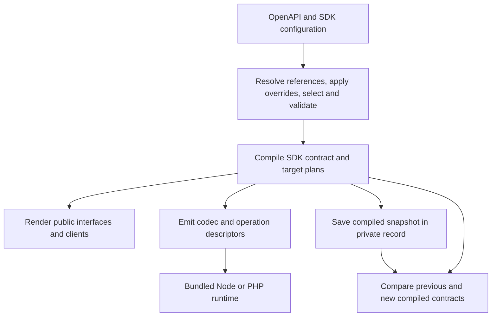

# Compiled SDK contract

The generator resolves OpenAPI and SDK configuration into a compiled contract before emitting packages. That contract contains public declarations, runtime instructions, operation settings, and compatibility facts. Renderers and compatibility checks use the compiled decisions.

The supported API subset, configuration, public interfaces, and runtime requirements are documented in the [support matrix](../support-matrix.md), [configuration guide](../configuration.md), [consumer guide](../using-sdks.md), and [release guide](../releases.md). The [preservation inventory](compiled-sdk-preservation.md) records the migration baseline, tests, measurements, and completion checks.

## Data flow



| Responsibility                                                                                   | Implementation                                                                             |
| ------------------------------------------------------------------------------------------------ | ------------------------------------------------------------------------------------------ |
| Local input loading, reference resolution, overrides, selection, validation and source hashes    | `src/contract.ts`                                                                          |
| Numeric representation, direction, required keys, constraints and codec instructions             | `src/codec-plan.ts`                                                                        |
| Operation descriptors and runtime configuration                                                  | `src/runtime-plan.ts`                                                                      |
| TypeScript declarations, PHP types and declaration rules                                         | `src/target-types.ts`                                                                      |
| Public model/method plans, PHP class routing, factories, getters, guards and documentation types | `src/target-plan.ts`                                                                       |
| Public response types and runtime value guarantees                                               | `src/response-plan.ts`                                                                     |
| Input acceptance, existing-status wire rules and annotation policies                             | `src/schema-policy.ts`                                                                     |
| Returned-value inclusion and target comparison                                                   | `src/value-guarantee.ts`, `src/response-compatibility.ts`, `src/compiled-compatibility.ts` |
| Snapshot validation and shared-reference storage                                                 | `src/compiled-record.ts`                                                                   |
| Package rendering, regeneration and release orchestration                                        | `src/generate.ts`                                                                          |
| Codec execution, exact JSON, models, HTTP and client lifecycle                                   | `src/runtime.ts`, `templates/Runtime.php`                                                  |

Compilation and comparison use explicit inputs and have no filesystem, network, clock or environment dependencies. Generation owns file reads, staging, artifact hashes and output writes. Compiler dependency tests check imports and cycles.

## Codec behavior

A codec describes accepted caller values, JSON wire representation, and decoded values. These can differ. An `int64` value accepts an exact numeric string from the caller, writes an unquoted JSON number token, and returns an exact string after decoding. An ordinary string uses a different instruction even though both public output types are strings.

Codecs retain named fields, required-only keys, additional-field rules, nullability, enum membership, integer ranges, supported constraints, sensitivity, compositions and references. Recursive references identify named definitions. They do not require expanding a value graph indefinitely.

Request encoding, ordinary response decoding, and alternative matching have separate execution contexts. Requests enforce encoding requirements and the configured validation profile. Ordinary responses preserve unknown fields, enum members and variants while checking representable known shapes. Matching uses the stricter checks needed to select a branch or narrow a known variant.

TypeScript and PHP keep their existing public representations and documented target differences. Language-specific runtimes implement exact JSON, object/list handling, transport, retry scheduling, cancellation and inspection. Unknown serialized instructions fail validation.

## Public schema helpers

Generated methods receive compiled descriptors. Public schema-taking helpers accept schemas supplied by an application after installation:

```text
Generated method → compiled descriptor → codec execution
Schema helper → schema adapter → codec execution
```

Node bundles the same pure codec compiler used by generation. PHP's `Internal\SchemaAdapter` translates schemas into the common descriptor format. Both adapters delegate value handling to the descriptor executor. Ordinary generated operations have no schema-adapter fallback.

The existing `serialize`, `Model`, `redact`, runtime-subpath helpers and PHP schema-taking APIs retain their signatures. Node helpers retain caller-owned schema mutation behavior. Adapters have no global schema cache or installed-generator dependency. Tests run independent serialization fixtures through dynamic and compiled paths, and run generated HTTP fixtures with adapters disabled.

PHP still requires its own translator and runtime primitives. Changes to shared semantics require corresponding PHP coverage. The [contributor rules](../../CONTRIBUTING.md#code-design-and-review-rules) define ownership and enforcement requirements.

## Public types and runtime guarantees

Public type precision and runtime enforcement are separate facts. TypeScript can expose an additional field as `unknown` while the codec enforces required keys inside its value.

For example:

```json
{
  "type": "object",
  "properties": { "label": { "type": "string" } },
  "required": ["entry"],
  "additionalProperties": {
    "type": "object",
    "required": ["id"],
    "additionalProperties": { "type": "string" }
  }
}
```

The runtime accepts `{"entry":{"id":"abc"}}` and rejects `{"entry":{}}`. TypeScript exposes `entry` as `unknown`. Adding a success result that permits the missing nested `id` loses a runtime guarantee and is breaking, even when the TypeScript declaration is unchanged.

The comparison covers three distinct dictionary cases:

| Added result                                                       | Public-type effect                                               | Runtime effect                      | Finding  |
| ------------------------------------------------------------------ | ---------------------------------------------------------------- | ----------------------------------- | -------- |
| A pure dictionary replaces a previously declared required property | The dictionary declaration does not guarantee the named property | The codec can still require the key | Breaking |
| A dictionary permits a previously required key to be absent        | Declaration can remain unchanged                                 | Required-key guarantee is lost      | Breaking |
| A mixed object's additional values lose a nested required key      | Additional values can remain `unknown`                           | Nested guarantee is lost            | Breaking |

Named-property rules take precedence for their keys. Other keys follow the additional-field rule. Ordinary responses continue to tolerate extra fields when `additionalProperties` is false.

## Compatibility decisions

Inputs are compared in the direction of preserving accepted calls and encoding. Outputs are compared in the direction of preserving guarantees for existing consumers. Public model/factory declarations, getters, known guards, iterator types, PHP class identities, body presence, status routing and existing HTTP checks are included.

| Public-type result | Runtime result           | Combined shape finding                         |
| ------------------ | ------------------------ | ---------------------------------------------- |
| Incompatible       | Any                      | Breaking                                       |
| Any                | Incompatible             | Breaking                                       |
| Compatible         | Compatible               | No shape break; applicable HTTP review remains |
| Unresolved         | Compatible or unresolved | Review                                         |
| Compatible         | Unresolved               | Review                                         |

A proven break remains breaking when another comparison is unresolved. Findings identify the affected operation, response or field and the lost guarantee.

Added results are checked against all applicable previous success, 304 and default results. Failure to fit one member does not prove failure to fit the complete previous union. Absent bodies and JSON null are distinct. Inclusion compares decoded values, so an exact-number string can fit a previous string result; existing-status wire checks retain their separate policy.

PHP response classes retain status-based and branch-position names. Adding a class outside the previous return type, removing a public getter or reassigning a tagged response class can break unchanged consumers. PHP checks apply when PHP remains a selected target; target removal is reported separately.

Returned-value inclusion covers single explicit scalar, object and array types, pure and mixed dictionaries, nested forms, standalone null and absent bodies. Recursive references, complex compositions, typeless schemas, nullable type unions and arbitrary result unions retain review findings where proof is unavailable. Generation and execution support for these constructs is unchanged.

Nested input changes in `allOf`, `anyOf` and `not` can still require manual review. The release policy and acknowledgment behavior are documented in [releases](../releases.md#known-compatibility-limitations).

## Historical records

Private generation record version 2 stores the source contract, provenance, owned-file hashes, compiled target snapshots and runtime identity. Repeated compiled subtrees use `shared-json-v1` storage. Restoration validates the references and the complete logical plan before comparison. Unknown formats, unknown encodings and malformed records produce diagnostics.

Regeneration preserves the previous comparison baseline at the same package version and through release preparation. A compatibility change can retain that baseline even when no generated file changes. Legacy records keep source provenance and version history, with review findings for historical behavior that cannot be recovered.

Saved snapshots allow comparison of generator-only changes that identical source schemas cannot describe. Runtime identity changes and unexplained descriptor changes also retain review findings. Equal value plans do not establish equivalence of arbitrary runtime or transport implementations.

The public `compare(before, after)` API compiles its source arguments under current semantics. Generation and release preparation use the recorded historical plans when available. Private records are excluded from distributed SDK archives.

## Validation and scope

Validation includes compiler decisions, unchanged TypeScript/PHP consumers, independent wire fixtures, bounded compatibility combinations, recursive/composed/nullable execution, dynamic helpers, generated-package installation, release policy, record migration and corruption handling. The runtime matrix covers Node 22.16/PHP 8.2 and Node 24/PHP 8.5. Formatting, TypeScript checks and package dry runs are required.

The preservation inventory maps every configuration group, nested operation setting, consumer option and public API to evidence. It also reports generation time, private-record size, package size and nested decoding cost. Generation has additional compilation and snapshot-storage work; its cost is measured separately from client decoding.

This architecture keeps the existing supported languages, OpenAPI subset, provider configuration, public naming, transport policy and publication workflow. Compatibility proof remains bounded, and independent provider fixtures remain necessary to verify server behavior.
